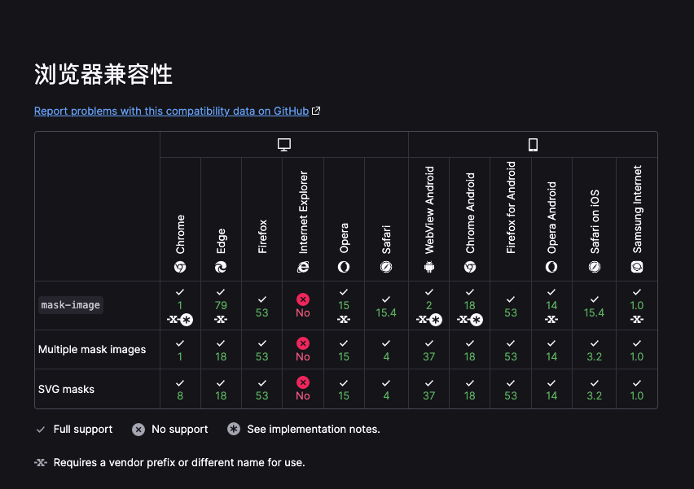

<h1 align="center">优惠券样式</h1>

<p align="center">生成优惠券样式代码</p>

[](https://wuchendi.github.io/coupon-styles/)

简体中文 | [English](./README.md)

## ✨ 特性

- 🛡 使用 [Nuxt](https://nuxt.com/)

## 🎯 兼容环境

[](https://developer.mozilla.org/zh-CN/docs/Web/CSS/mask-image#%E6%B5%8F%E8%A7%88%E5%99%A8%E5%85%BC%E5%AE%B9%E6%80%A7)

## 💻 本地调试

```bash
git clone https://github.com/WuChenDi/coupon-styles.git
cd coupon-styles
pnpm install
pnpm dev
```

> 📢 npm 访问速度较慢，建议使用 cnpm 或者指定镜像 registry。
>
> 📢 需要 Node.js 版本 >= 14
>
> 📢 npm install -g pnpm
>
> 📢 打开 http://localhost:3000

## 🤝 参与共建

如果您对这个项目感兴趣，欢迎提 pull request，也欢迎 "Star" 支持一下 ^\_^

## 📜 License

[MIT](./LICENSE) License &copy; 2022-PRESENT [wudi](https://github.com/WuChenDi)

<!-- ↓ Reference -->
<!-- https://github.com/XboxYan/coupon -->
<!-- https://github.com/alibaba/lowcode-engine.git -->
