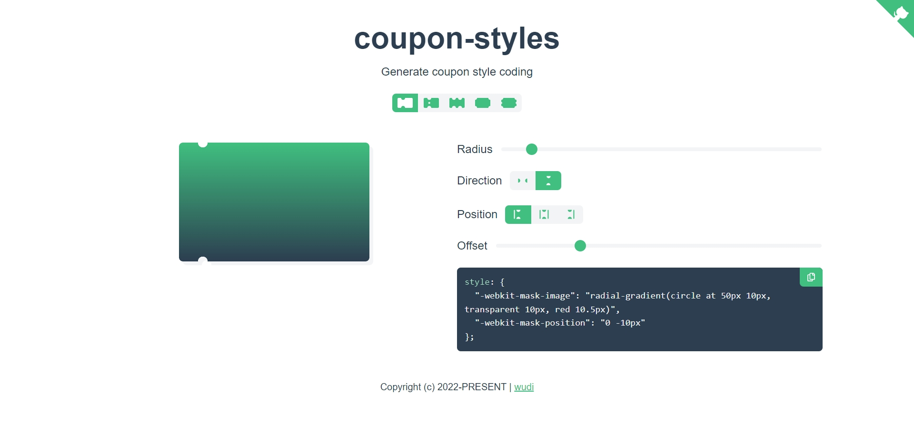

<h1 align="center">Coupon-styles</h1>

<p align="center">Generate coupon style coding</p>

[](https://wuchendi.github.io/coupon-styles/)

<!-- English | [简体中文](./README-zh_CN.md) -->

## ✨ Features

- 🛡 Developed with [Nuxt](https://nuxt.com/)

## 🎯 Compatible Environments

[](https://developer.mozilla.org/en-US/docs/Web/CSS/mask-image#browser_compatibility)

## 💻 Local debugging

```bash
git clone https://github.com/WuChenDi/coupon-styles.git
cd coupon-styles
pnpm install
pnpm dev
```

> 📢 npm access speed is slow, recommend using cnpm or specifying a mirror registry.
>
> 📢 requires Node.js version >=14
>
> 📢 npm install -g pnpm
>
> 📢 Then open http://localhost:3000

## 🤝 Participate in co-construction

If you are interested in this project, welcome to make a pull request and also welcome "Star" support ^\_^

## 📜 License

[MIT](./LICENSE) License &copy; 2022-PRESENT [wudi](https://github.com/WuChenDi)

<!-- ↓ Reference -->
<!-- https://github.com/XboxYan/coupon -->
<!-- https://github.com/alibaba/lowcode-engine.git -->
