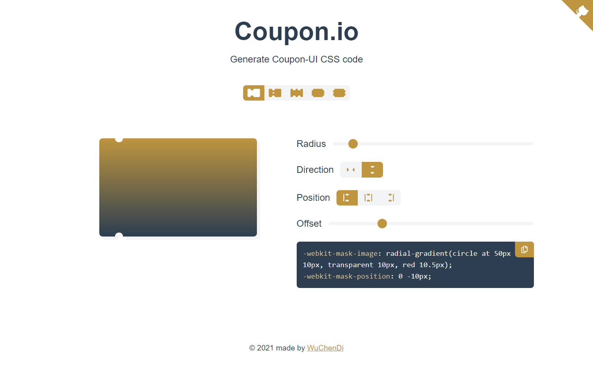

# Coupon-styles

Generate coupon style coding

Developed with Vue 3 + Typescript + Vite



[online preview](https://coupon.codelabo.cn)

In the project directory, you can run:

```bash
npm install
npm run dev
```

Then open http://localhost:3000

<!-- ↓ Reference -->
<!-- https://github.com/XboxYan/coupon -->